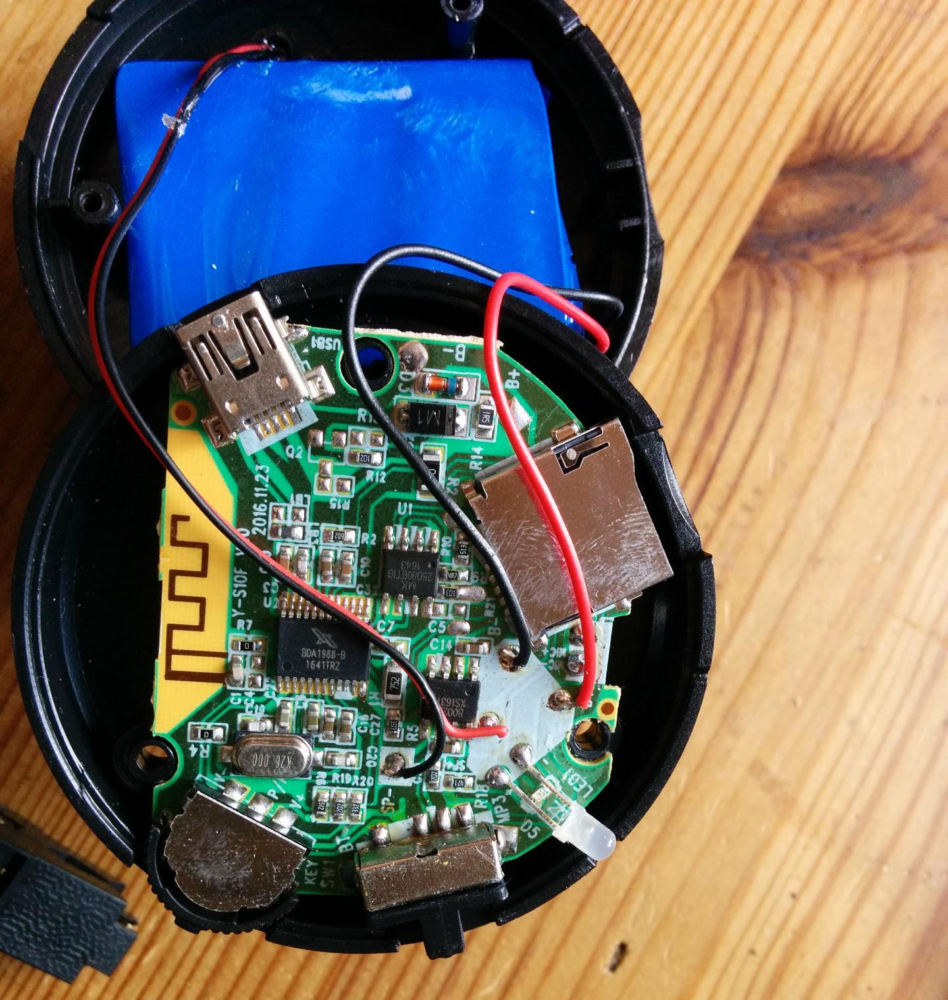

I got this Bluetooth speaker as a giveaway and was suprised by the amount of 
features in this cheap device: Bluetooth speaker/headset, play MP3 from 
TF card (microSD), FM radio, AUX input. That's more than the average hifi set can do...
On the other hand, when turning on, switching modes, or on low battery, really loud,
annoying voice announcements are played. I wanted to get rid of them, so I started reversing this box.

To tear down, three screws on the bottom need to be opened. A rubber cover is over
them. If one heats it with a fan before, it might be removed undestroyed and 
reattached later. Otherwise, you could maybe poke holes through the cover 
and unscrew it through them. I just ripped the cover off and it's in three pieces 
now and won't stick anymore... :(


## Photo of PCB




## Bluetooth SOC
Chip marking: BDA1988-B

I found no information whatsoever on the internet about this chip.


## SPI Flash Memory
Chip marking: MK 25D80BTIG

According to the flashrom tool, this chip is equivalent to the Winbond W25Q80.V.

Flashrom output while writing the SPI flash:
```
% sudo flashrom -p ch341a_spi -w bluetooth_speaker_flash_neu2.img
flashrom v0.9.9-r1955 on Linux 4.12.13-1-ARCH (x86_64)
flashrom is free software, get the source code at https://flashrom.org

Calibrating delay loop... OK.
Found Winbond flash chip "W25Q80.V" (1024 kB, SPI) on ch341a_spi.
Reading old flash chip contents... done.
Erasing and writing flash chip... Erase/write done.
Verifying flash... VERIFIED.
```

## Charging controller (?)
Chip marking: 8002 XS163


## Flash contents

The offsets of different parts of the flash contents are listed 
in fwlist.txt, the first column being the offset in bytes (hex), 
the second column a filename made up by me.
The first ~250 kb seem to be the firmware code itself, I think it
is in a compressed and/or encrypted form, according to 
`binwalk -E` the entropy is quite high.

After that, the MP3 files for the voice announcements follow, together ~76 kb.

The rest of the flash is sparsely filled with what looks like a wear-levelled 
EEPROM emulation to save preferences like last played track from TF 
card (which is saved!) or volume (which is not saved...), and which is 
written to very actively while the speaker is on.


